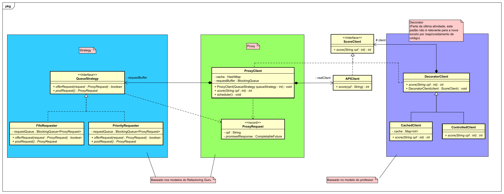

# Desafio Proxy Interno

Este projeto implementa a solucao proposta no desafio descrito em `Desafio — “Proxy interno”.pdf`.
Está na pasta do repositório referenciada como: [https://github.com/getHenrique/TDSOFT/tree/main/myScorer](https://github.com/getHenrique/TDSOFT/tree/main/myScorer)

## Como o desafio foi resolvido
A implementacao segue o desenho descrito em:
 (Diagrama anexado no projeto)

Foi implementado um Proxy chamado ProxyClient que recebe requisições de clientes e as processa antes de repassar para o APIClient, que por sua vez faz a requisição real à API.
O Proxy recebe as requisições e as coloca em uma buffer interno em formato de fila. Seu scheduler então envia uma requisição da fila a cada segundo para o APIClient tratar. Para cada cpf recebido, há um cache que armazena a resposta referente a este, caso o cpf já esteja em cache, a resposta é retornada ao requisitante imediatamente, sem a necessidade de passar pela API.
Foram implementadas duas estratégias de fila para o buffer do proxy (FIFO e por prioridade). Para isso, usei o padrão strategy. O padrão em si funciona normalmente, mas infelizmente não consegui implementar algo que fizesse a diferenciação real destas e que pudesse fazer uso de estratégias diferentes em runtime.
Pelo que entendi, o cache pode ser considerado como estratégia para fallback, então foi isso que fiz.
Creio que os logs são explicativos o suficiente para a execução de cada caso, mas penso que o projeto está deficiente em comentários com documentação e anotações.
Criei um controller para expor GET /proxy/score na porta 8080, funciona bem, tente http://localhost:8080/proxy/score?cpf=892.860.480-09 Não consegui fazer os outros dois requisitos funcionais funcionarem como esperado, tentei usar o SpringBoot para facilitar e não foi suficiente. Você ainda pode tentar com /actuator/metrics e /actuator/health

## Padrões adotados
Proxy para controlar fluxo de requisições à API real.
Strategy para usar diferentes estratégias de fila no buffer interno do proxy.

## Experimentos
### Rajada Controlada
###########Inicindo Rajada controlada:################
2026-04-12T23:48:45.534-04:00  INFO 8280 --- [   scheduling-1] f.ufms.myScorer.apiProxy.ProxyClient     : Processando fila. Chamando upstream para CPF: 736.489.210-96
2026-04-12T23:48:46.410-04:00  INFO 8280 --- [   scheduling-1] f.ufms.myScorer.apiProxy.ProxyClient     : Sucesso! Score de 319 obtido para CPF: 736.489.210-96
2026-04-12T23:48:46.410-04:00  INFO 8280 --- [           main] f.ufms.myScorer.apiProxy.ProxyClient     : Sucesso! Score em cache do CPF 736.489.210-96 é: 319
2026-04-12T23:48:47.411-04:00  INFO 8280 --- [   scheduling-1] f.ufms.myScorer.apiProxy.ProxyClient     : Processando fila. Chamando upstream para CPF: 837.968.450-88
2026-04-12T23:48:47.534-04:00  INFO 8280 --- [   scheduling-1] f.ufms.myScorer.apiProxy.ProxyClient     : Sucesso! Score de 385 obtido para CPF: 837.968.450-88
2026-04-12T23:48:47.534-04:00  INFO 8280 --- [           main] f.ufms.myScorer.apiProxy.ProxyClient     : Sucesso! Score em cache do CPF 837.968.450-88 é: 385
2026-04-12T23:48:48.536-04:00  INFO 8280 --- [   scheduling-1] f.ufms.myScorer.apiProxy.ProxyClient     : Processando fila. Chamando upstream para CPF: 734.055.940-06
2026-04-12T23:48:48.592-04:00  INFO 8280 --- [   scheduling-1] f.ufms.myScorer.apiProxy.ProxyClient     : Sucesso! Score de 241 obtido para CPF: 734.055.940-06
2026-04-12T23:48:48.592-04:00  INFO 8280 --- [           main] f.ufms.myScorer.apiProxy.ProxyClient     : Sucesso! Score em cache do CPF 734.055.940-06 é: 241
2026-04-12T23:48:49.594-04:00  INFO 8280 --- [   scheduling-1] f.ufms.myScorer.apiProxy.ProxyClient     : Processando fila. Chamando upstream para CPF: 514.790.640-17
2026-04-12T23:48:49.650-04:00  INFO 8280 --- [   scheduling-1] f.ufms.myScorer.apiProxy.ProxyClient     : Sucesso! Score de 253 obtido para CPF: 514.790.640-17
2026-04-12T23:48:49.650-04:00  INFO 8280 --- [           main] f.ufms.myScorer.apiProxy.ProxyClient     : Sucesso! Score em cache do CPF 514.790.640-17 é: 253
2026-04-12T23:48:49.651-04:00  INFO 8280 --- [           main] f.ufms.myScorer.apiProxy.ProxyClient     : Sucesso! Score em cache do CPF 736.489.210-96 é: 319
2026-04-12T23:48:49.651-04:00  INFO 8280 --- [           main] f.ufms.myScorer.apiProxy.ProxyClient     : Sucesso! Score em cache do CPF 837.968.450-88 é: 385
2026-04-12T23:48:49.651-04:00  INFO 8280 --- [           main] f.ufms.myScorer.apiProxy.ProxyClient     : Sucesso! Score em cache do CPF 734.055.940-06 é: 241
2026-04-12T23:48:49.651-04:00  INFO 8280 --- [           main] f.ufms.myScorer.apiProxy.ProxyClient     : Sucesso! Score em cache do CPF 514.790.640-17 é: 253
2026-04-12T23:48:49.651-04:00  INFO 8280 --- [           main] f.ufms.myScorer.apiProxy.ProxyClient     : Sucesso! Score em cache do CPF 736.489.210-96 é: 319
2026-04-12T23:48:49.651-04:00  INFO 8280 --- [           main] f.ufms.myScorer.apiProxy.ProxyClient     : Sucesso! Score em cache do CPF 837.968.450-88 é: 385
2026-04-12T23:48:49.651-04:00  INFO 8280 --- [           main] f.ufms.myScorer.apiProxy.ProxyClient     : Sucesso! Score em cache do CPF 734.055.940-06 é: 241
2026-04-12T23:48:49.651-04:00  INFO 8280 --- [           main] f.ufms.myScorer.apiProxy.ProxyClient     : Sucesso! Score em cache do CPF 514.790.640-17 é: 253
2026-04-12T23:48:49.651-04:00  INFO 8280 --- [           main] f.ufms.myScorer.apiProxy.ProxyClient     : Sucesso! Score em cache do CPF 736.489.210-96 é: 319
2026-04-12T23:48:49.653-04:00  INFO 8280 --- [           main] f.ufms.myScorer.apiProxy.ProxyClient     : Sucesso! Score em cache do CPF 837.968.450-88 é: 385
2026-04-12T23:48:49.653-04:00  INFO 8280 --- [           main] f.ufms.myScorer.apiProxy.ProxyClient     : Sucesso! Score em cache do CPF 734.055.940-06 é: 241
2026-04-12T23:48:49.654-04:00  INFO 8280 --- [           main] f.ufms.myScorer.apiProxy.ProxyClient     : Sucesso! Score em cache do CPF 514.790.640-17 é: 253
2026-04-12T23:48:49.654-04:00  INFO 8280 --- [           main] f.ufms.myScorer.apiProxy.ProxyClient     : Sucesso! Score em cache do CPF 736.489.210-96 é: 319
2026-04-12T23:48:49.654-04:00  INFO 8280 --- [           main] f.ufms.myScorer.apiProxy.ProxyClient     : Sucesso! Score em cache do CPF 837.968.450-88 é: 385
2026-04-12T23:48:49.654-04:00  INFO 8280 --- [           main] f.ufms.myScorer.apiProxy.ProxyClient     : Sucesso! Score em cache do CPF 734.055.940-06 é: 241
2026-04-12T23:48:49.654-04:00  INFO 8280 --- [           main] f.ufms.myScorer.apiProxy.ProxyClient     : Sucesso! Score em cache do CPF 514.790.640-17 é: 253
### Penalidade Proposital 
######################Sem proxy:##########################
2026-04-12T23:48:49.808-04:00 ERROR 8280 --- [pool-2-thread-2] facom.ufms.myScorer.APIClient            : API request failed. Status: 429 {"error":"Aguarde 2000ms"}
2026-04-12T23:48:50.162-04:00 ERROR 8280 --- [pool-2-thread-1] facom.ufms.myScorer.APIClient            : API request failed. Status: 429 {"error":"Aguarde 1642ms"}

A política de fila não foi completa o suficiente para testes efetivos. As métricas do Spring falharam o teste manual.

## Análise crítica
Os principais trade-offs no desenvolvimento deste trabalho foram em questão de projeto. Infelizmente o escopo acabou se mostrando extenso para meu conhecimento, e o custo em tempo que realizei não compensou o tempo extra para a entrega.

## Execução do projeto
Execute o projeto com IntelliJ e Java25, infelizmente não tive tempo para pesquisar como construir um container docker e infelizmente ainda não sei como fazê-lo.